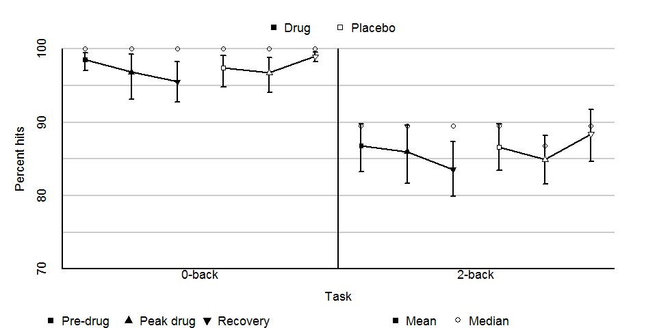
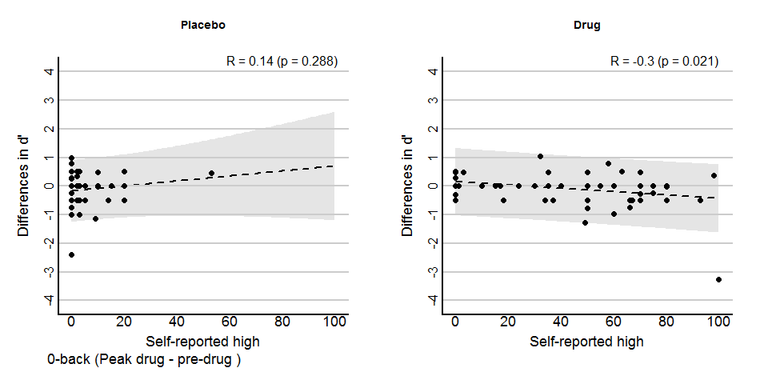
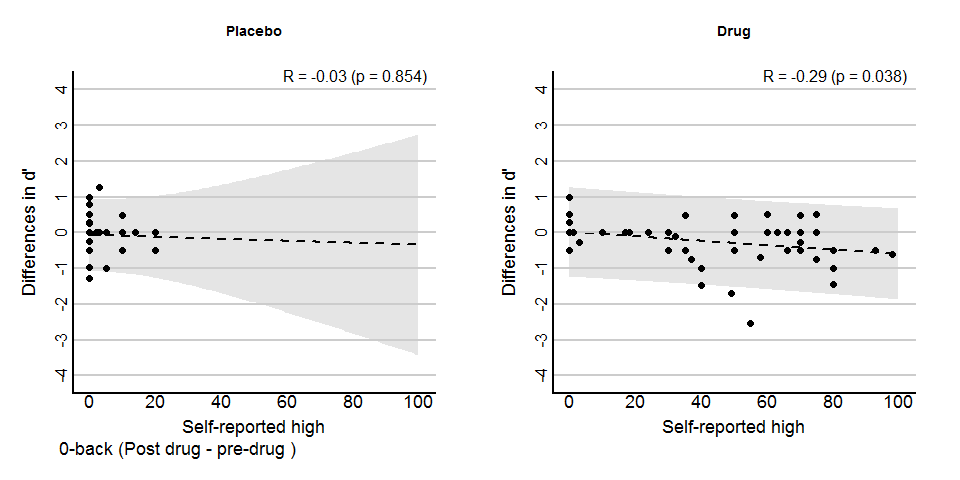
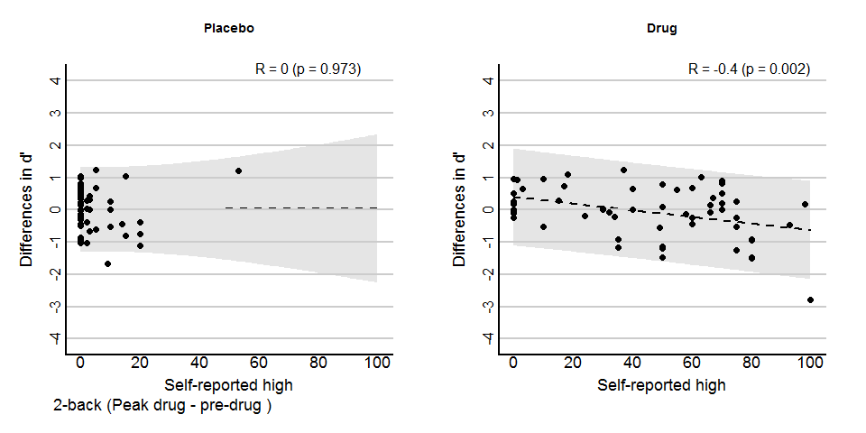
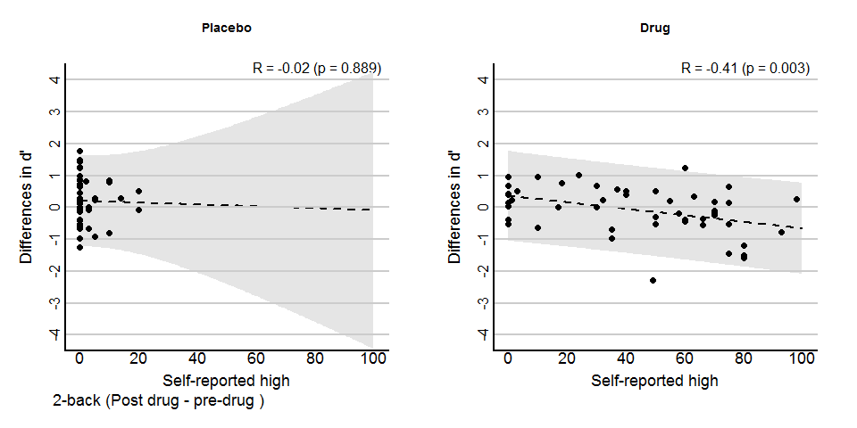
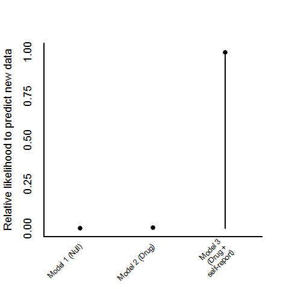
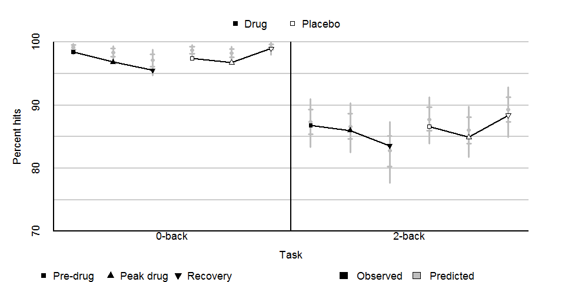
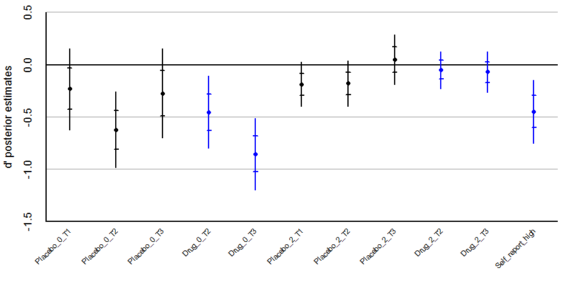
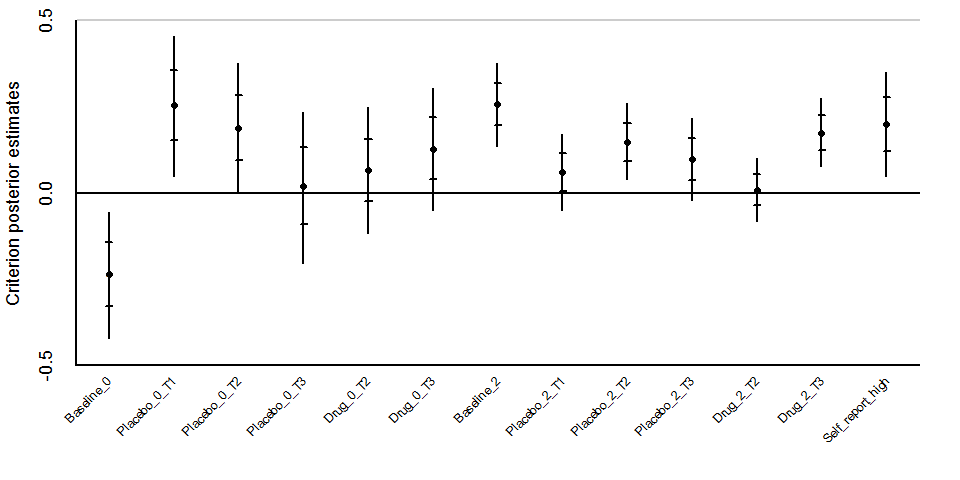

```{r setup, include=FALSE}
knitr::opts_chunk$set(echo = TRUE)
```

### Introduction

This is a brief report of the (ongoing) behavioral analyses for the 
THC fNIRS study run by Dr. Gilman.

The behavioral data of interest consist of the performance of 66 subjects on two versions of a N-back task. Subjects completed a 0-back task (simply identify when a target letter was present), and a 2-back task (identify when a target matches a previous presentation 2 instances ago). Performance can be broken down into the frequency of hits (the number of times subject correctly identified when a target was present), and the frequency of false alarms (the number of times subjects incorrectly stated the target was present though it was not).

Subjects completed these tasks over two sessions, during one of which they were given a dose of THC, and another in which they received a placebo. During each session, subjects were measured at 3 time-points: 1) Pre-drug adminstration, 2) post-drug adminstion at the peak height of drug efficacy, and 3) post-drug adminstration during recovery from the drug's effects. Table 1 lists out the combinations of these conditions:

#### Table 1

Number | Task   | Condition | Time-points         
------ | ------ | --------- | --------------------
1      | 0-back | Placebo   | Pre-drug            
2      |        |           | Post-drug (Peak)    
3      |        |           | Post-drug (Recovery)
4      |        | Drug      | Pre-drug            
5      |        |           | Post-drug (Peak)    
6      |        |           | Post-drug (Recovery)
7      | 2-back | Placebo   | Pre-drug            
8      |        |           | Post-drug (Peak)    
9      |        |           | Post-drug (Recovery)
10     |        | Drug      | Pre-drug            
11     |        |           | Post-drug (Peak)    
12     |        |           | Post-drug (Recovery)

The study was within-subjects, though there is some missing 
data (i.e., certain subjects failed to complete specific 
conditions).

The research question is whether drug administration lead to worse performance on the N-back tasks, which would indicate that THC had an adverse effect on memory performance.

### Descriptive statistics

Figure 1 presents the average percent hits over subjects for the 12 conditions. Error bars represent 95% bootstrap confidence intervals. The median percent hits (empty circles) are provided to emphasize the skewed distributions - some subjects had exceptionally worse performance which drag down the means.



For each subject, the hits and false alarms can be turned into a condition by condition estimate of d' and bias using a basic signal detection theory (SDT) model. Here, d' represents a subject's ability to detect the target (which I assume is a more perceptual process for the 0-back task, and a more memory-intensive process for the 2-back task). In figures 2 to 5, I take the difference between the estimated d' values for the pre and post-drug groups and then plot these values against the subjects' self-reported sensation of a high. Consistently across all four drug conditions, there is a negative relation between d' and self-reported highs. In contrast, across all placebo conditions there is no signicant relation between d' and self-reported highs.









### Hierarchical SDT model

To test the research hypothesis, I fit three hierarchical SDT models to the hit and false alarm frequencies. These models bear similarities to logistic regression, in that the observed data is not well modeled by standard linear models. However, via a link function (here the SDT model), we can convert the observed data into d' and bias estimates, which are more easily modeled and psychologically interpretable. The hierarchical aspect of the model means we are able to better estimate the uncertainty of the group-level parameters based on the uncertainty at the level of a subject. For example, estimates for subjects who had extreme levels performance (e.g., subjects who did unusually badly at the 0-back task) will be shrunk towards the overall mean based on the performance of the rest of the group. In all the models reported below, I assume a set of random intercepts for the two task types. In other words, each subject had his or her own unique performance (i.e., d' and bias levels) on the 0-back and 2-back tasks, but the estimates of these performance were informed by the overall performance.

#### Model 1 (The null model)

The first model I fit assumed that group-level performance would depend on the type of task (0-back versus 2-back), as well as the time-points. Critically though, the model includes no effects for the drug adminstration, nor any moderation by self-reported highs. If this model fits poorly, it emphasizes the need to include those additional effects, providing a useful baseline assessment of the research hypothesis.

#### Model 2 (No effect of self-reported high)

The second model I fit assumed that group-level performance would depend on task type, drug type (placebo or THC), and the time-points. There are 24 group means we are trying to fit (12 hit rates and 12 false alarm rates). The second model has 24 parameters (12 d' means and 12 bias means), with a planned contrast to assess what conditions differed from the reference groups of interest, the pre-drug conditions before THC (rather than the placebo) was adminstered. However, this model did not include any moderating effect of self-reported highs.

#### Model 3 (Moderating effect of self-reported high)

The final model I fit was similar to the second model, but included an additional moderating effect of self-reported high. In other words, the group means for d' and bias could be impacted by the degree of self-reported high.

### Model comparisons

We can compare the relative fit of these models using the 'Leave-one-out' (LOO) information criterion. This test indicates whether we can safely determine if model prediction is improved by including effects for drug adminstration and self-reported highs. Figure 6 reports the relative likelihood for each model's ability to predict future data generated from the same process that produced the current dataset. The figure provides strong evidence that both an effect of drug adminstration and self-reported highs is necessary for the current dataset. The next question and the nature of these effects, in particular, whether drug adminstration lead to a negative impact on memory performance.



### Goodness-of-fit

The model comparison indicates that the third model, which assumes that drug adminstration impacted performance and this was moderated by self-reported highs, did the best. However, this was a relative comparison, so it is useful to examine how well the model is able to fit the group-level means of interest. Figure 7 once again presents the average percent hits over subjects for the study conditions, but this time includes (in grey) the 95% and 68% credible intervals for model predictions, as well as the predicted average (all in grey). The model in general does a good job fitting the data (as hoped, considering the number of group-level parameters technically exceeds the number of group means). There is some overestimation for the 0-back task, but this is not surprising because the observed means are biased by a few low-performing subjects, and the hierarchical aspect of the model compensates for this fact.



### Credible intervals for model coefficients

Having determined that the additional effects of drug adminstration and self-reported highs are necessary, and confirming that the model is able to fit the data, I now present in Figure 8 the credible intervals for the model coefficients. This allows us to determine whether drug adminstration actually had a negative impact on performance, and whether this impact was moderated by how high a subject felt. The outer error bars are 95% credible intervals, the inner bars are 68% intervals. Posterior means are also reported. Unlike confidence intervals, credible intervals provide the range of plausible values for coefficients (conditioned on the data and prior beliefs). For clarity, 5 effects of interest are highlighted in blue: the difference between pre and post-drug d' levels for the peak and recovery periods of each task, as well as the moderating effect of self-reported highs.



As seen in the figure, for the 0-back task, there was a significant drop in d' for the two post-drug measurement timepoints. Strangely, there was also a significant drop in the placebo phase for the first post-drug measurement. The 0-back task was near (often at) ceiling, so these effects perhaps should be interpreted with caution - due to the non-linear relation between d' and observed performance, small differences in near-ceiling performance can result in large d' differences.

As for the 2-back task, there was no significant effect of drug adminstration on d', as was the case for the placebo conditions. Critically, however, there was a moderate significant effect of self-reported high. Furthermore, it is in the predicted direction of the original research hypothesis. Subjects who reported a greater sensation of being high had larger decrements in d' values.

For completedness, Figure 9 presents the credible intervals for the coefficients underlying bias. The SDT models applied to the data were parameterized so that a subject with bias would have an estimate of 0. A subject biased against indicating the presence of a target would have *positive* estimates, while a subject biased towards indicating the presence of a target more often would have *negative* estimates. However, bear in mind that the reported coefficients represent the change made to the *baseline* coefficients. For example, the pre-drug coefficient for the placebo condition in the 0-back task is significantly positive. This coefficient, though, modifies the baseline value for the 0-back task, which is significantly negative. Hence, the net result is a value near zero, indicating no bias. Two features are noteworthy with the bias coefficients. First, there was a significant degree of bias against responding for the 2-back task, which occasionally worsened at later timepoints. Second, subjects appeared to become more biased against responding with a greater sensation of a high.





